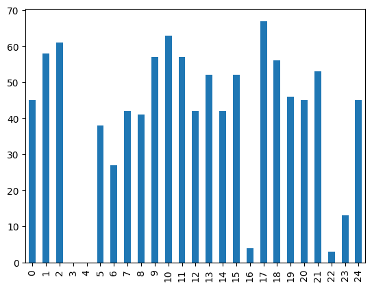
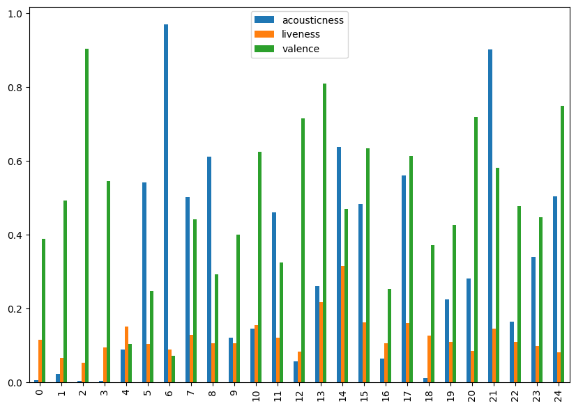
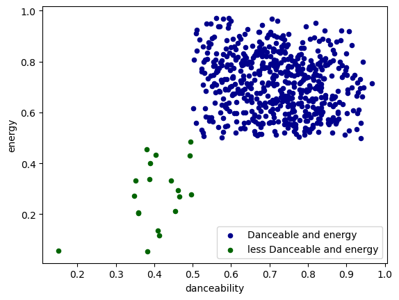
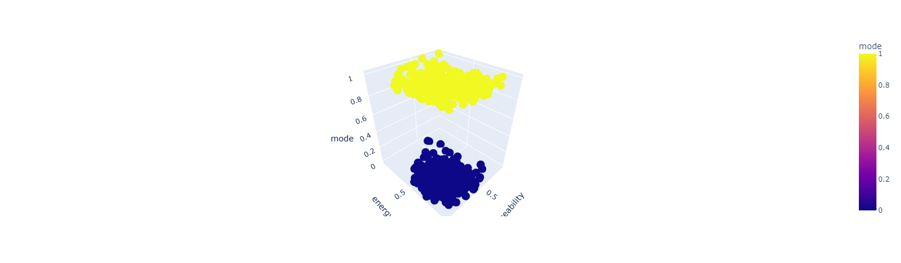
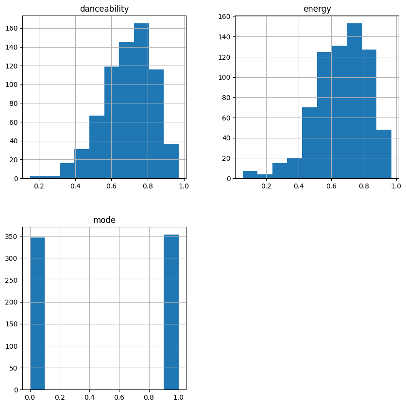
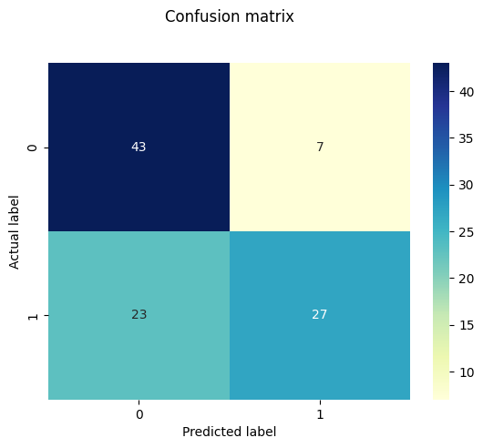
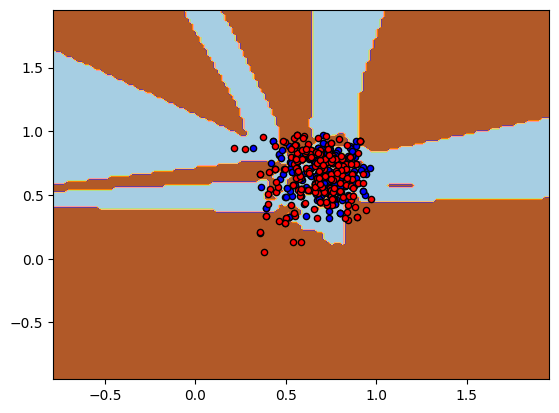

<p align="center" width="100%">
    
</p>


# Spotify-classification-song-KNN
Here is a project that I made which contains graphics and analysis of a dataset that I found about songs and the caracteristic of them.
The aim of the project is to make prediction of what modes (major or minor) belong a sampled songs using 2 caracteristics like danceability and rythm.

## Summaries:
  1. **[Data cleaning](#Data-cleaning)**
  2. **[Data selection](#Data-selection)**
  3. **[Interpretation, Classification and plot](#ploty)**
        - [Interpretation](#i)
        - [Classification Data](#c)
  4. **[Machine Learning: KNN](#train)**
        - [Optimisation](#opti)
  5. **[Visualisation of the results](#result)**
       - [Confusion matrix](#confusion)
       - [Boundary decision](#boundary)
 # <a name = "Data-cleaning"></a>Data cleaning
 First of all, we import all necessary libraries:
  ```python
import pandas as pd
import matplotlib.pyplot as plt
import plotly.express as px
from sklearn import preprocessing
import seaborn as sns
from sklearn.metrics import confusion_matrix
from sklearn import metrics
 ```
 Nothing to do here because the data is organized and clean. So we use this code below:
 ```python
 data = pd.read_csv("hit_songs/Hit Songs/spotify_hits_dataset_complete.csv", sep='\t', parse_dates=True)
print(data.shape)
data.head()
 ```
 # <a name = "Data-selection"></a>Data selection
The interesting datas are : Song_name, artist name, and the different information about the song, such as the key of the song or bpm.
Code:
```python
song_information = data.iloc[0:25, 12:23]
```
# <a name = "ploty"></a>Interpretation of the datas
Lets plot some information like the popularity of the first 25 songs:
```python
artist_information["popularity"].plot.bar()
```


This one is about the the technical's details on the songs
```python
song_information[["acousticness", "liveness", "valence"]].plot.bar(figsize=(10,7))
```


# <a name="i"><a/>Interpretation
We can give an interpretation about these two graphics. 
- The first graphic shows the popularity of each song that we pick up.
- The second graphic shows differents bar which represent (based on 3 caracteristic) the efficiency of each song.


Let's explain these 3 caracteristics: 
1. **acousticness**:

    - Informs the probability of a song to be acoustic or not.


2. **liveness**:

    - Detects the presence of an audience in a song.       
    The higher the liveness value, the higher the        
    probability of a song being performed live.
    
    
3. **valence**:

    - Describes the positiveness within a song.          
      High valence values represent happier songs,        
      whereas low values characterize the opposite.

Finally we can assert that the most popular song on this subdata, which is *côte ouest* **n°17**, is not a liveness song but he's quite **acoustic** and has an average **valence**.
And the less popular songs on this selection has a less probability of acousticsness.
# <a name="c">Classification of the songs
This section is to classify the different song according to their:

1. **danceability**:
    - Combines tempo, rhythm and other elements         
      to inform if a song is suitable for dancing.

2. **mode**:
    - If the song is in the minor key or major key.
3. **energy**:
    - Represents the intensity and activity of a song by     
      combining information such as dynamic range, perceived   
    loudness, timbre, onset rate, and general entropy.

Let's separate in 2 group.
Code:
```python
df = data[["mode", "danceability", "energy"]].iloc[0: 750]
df_dance=df[df[["danceability", "energy"]] >= 0.5] # ig the song is "danceable"
df_less_dance=df[df[["danceability", "energy"]] <= 0.5] # if the song is not "danceable" 


ax = df_dance.plot.scatter(x="danceability", y="energy", color="DarkBlue", label="Danceable and energy")
df_less_dance.plot.scatter(x="danceability", y="energy", color="DarkGreen", label="less Danceable and energy", ax=ax)
df.plot.scatter(x="danceability", y="energy", c="mode" ,cmap="viridis", s=50, figsize=(10,7))
```
The idea above is to separate in 2 equivalent proportionnal groups showing how many songs have a higher chance to be danceable or not.


As we can see, there is much more songs on the dataset which have a good chance to be energetic and danceable.

Now, let's see if there is a good repartition between the songs according to their <a name="c"> modes (i.e major or minor)

We see that the modes have a good repartition between the songs.
# Final interpretation:
    1. There is much song in the minor key that they are in the major key.
    2. There is more songs that are danceable and energic.

# <a name="train"> Machine learning using KNN
Let's implement an algorithm using the model KNN with python in order to group the different type of music using 3 caracteristic such as danceability, energy, mode.
## Sampling data
Code:
```python
df1 = data[["song_name","danceability", "energy", "mode"]].iloc[0: 700]
df1.to_numpy()
df1.hist(figsize=(10,10))
sample = np.random.randint(df1.shape[0], size=500)
x = df1[["danceability", "energy"]].iloc[sample].to_numpy() # "danceability and energy of the song"
y = df1["mode"].iloc[sample]
lab = preprocessing.LabelEncoder()
y_transformed = lab.fit_transform(y)
```


## Train set and test set:
### We'll try to train our model firstly with K = 6.
```python
from sklearn.model_selection import train_test_split
xtrain, xtest, ytrain, ytest = train_test_split(x, y_transformed, train_size=0.8)
from sklearn import neighbors
knn = neighbors.KNeighborsClassifier(n_neighbors=6)
knn.fit(xtrain, ytrain.ravel())
```
    Let's see the first performance of our model:
```python
error = 1 - knn.score(xtest,ytest)
print(f"Error = {error}")
```
    output: Error = 0.43999999999999995
Well... our model do a mistake 1 over 2 times it's quite not good.
So let's see what is the most optimal K in order to have a better score in our prediction.
## <a name="opti">Optimisation

```python
errors = []
for k in range(2,15):
    knn = neighbors.KNeighborsClassifier(k)
    errors.append(100*(knn.fit(xtrain, ytrain.ravel()).score(xtest, ytest)))
plt.plot(range(2,15), errors, 'o-')
plt.show()
```

 ## New score for k = 2
 ```python
 best_k = neighbors.KNeighborsClassifier(n_neighbors=2)
best_k.fit(xtrain, ytrain.ravel())
print(f"Modèle d'entrainement {best_k.score(xtrain,ytrain)}")
predicted = best_k.predict(xtest)
print(f"Best score model now: {best_k.score(xtest, ytest)}")
 ```
    training set score: 0.83
    test set score: 0.7
    It's a little bit better
# <a name="result">Visualisation 
```python
cnf_matrix = metrics.confusion_matrix(ytest,predicted)
p = sns.heatmap(pd.DataFrame(cnf_matrix), annot=True, cmap="YlGnBu" ,fmt='g')
plt.title('Confusion matrix', y=1.1)
plt.ylabel('Actual label')
plt.xlabel('Predicted label')
```


### <a name="confusion">Here's the confusion matrix for the predicted value.

The top left square show us that **43** value predicted are really in the major key. The top right square shows us that our model predicted **7** songs which don't     belong to the major key but these songs belong for real to the major key.
The bottom left square represents the song which were predicted as  being in the minor key but are not really in the minor key. Thus, the opposite represent the songs that are really in the minor key.

## <a name="boundary">Boundary decision
### Final visuation of the Boundary decision
```python
h = .02   
colors = "bry"   
x_min, x_max = x[:, 0].min() - 1, x[:, 0].max() + 1   
y_min, y_max = x[:, 1].min() - 1, x[:, 1].max() + 1   
xx, yy = np.meshgrid(np.arange(x_min, x_max, h),   
                     np.arange(y_min, y_max, h))   
   
Z = best_k.predict(np.c_[xx.ravel(), yy.ravel()])   
Z = Z.reshape(xx.shape)   
cs = plt.contourf(xx, yy, Z, cmap=plt.cm.Paired)   
plt.axis('tight')   
   
for i, color in zip(best_k.classes_, colors):   
    idx = np.where(y == i)   
    plt.scatter(x[idx, 0], x[idx, 1], c=color, cmap=plt.cm.Paired, edgecolor='black', s=20)
```

